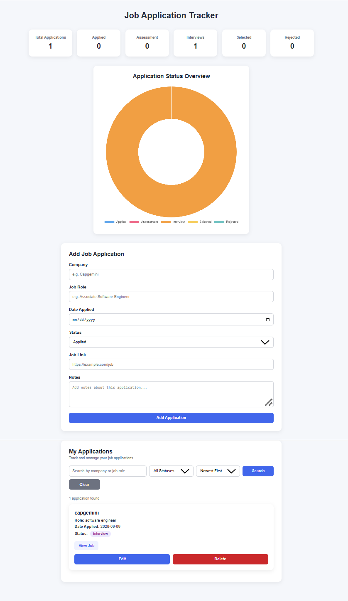

# Job Application Tracker



A web-based Job Application Tracker built using **Python Flask and SQLite** to help users manage and monitor their job applications in one place.

## Features

* Add job applications
* Edit application details
* Delete applications with confirmation
* Track application status
* Search applications by company or role
* Filter applications by status
* Sort applications by date and company
* View job posting links
* Dashboard with application statistics
* Application status visualization using Chart.js
* Input validation for application details
* Database error handling
* Application activity logging
* Automated tests using pytest
* Responsive and clean user interface

## Tech Stack

* **Python**
* **Flask**
* **SQLite**
* **HTML**
* **CSS**
* **JavaScript**
* **Chart.js**
* **pytest**

## Project Structure

```text
job-application-tracker/
│
├── app.py
├── README.md
├── screenshot.png
│
├── templates/
│   ├── index.html
│   └── edit.html
│
├── static/
│   └── style.css
│
└── tests/
    └── test_app.py
```

> **Note:** `jobs.db`, `application.log`, `venv/`, and pytest cache files should be excluded from GitHub using `.gitignore`.

## How to Run

### 1. Clone the repository

```bash
git clone https://github.com/Rafah241/job-application-tracker.git
```

### 2. Open the project directory

```bash
cd job-application-tracker
```

### 3. Create a virtual environment

```bash
python -m venv venv
```

### 4. Activate the virtual environment

**Windows:**

```bash
venv\Scripts\activate
```

### 5. Install dependencies

```bash
pip install flask pytest
```

### 6. Run the application

```bash
python app.py
```

Open the application in your browser at:

```text
http://127.0.0.1:5000/
```

## Running Tests

The project includes automated tests using **pytest**.

Run:

```bash
python -m pytest -v
```

The tests cover core application behavior including:

* Home page response
* Input validation
* Adding an application
* Deleting an application

## What I Learned

Through this project, I learned how to:

* Build a full-stack web application using Flask
* Connect a Flask application with SQLite
* Implement CRUD operations
* Handle HTML form data
* Perform server-side input validation
* Handle database errors safely
* Implement application logging
* Write automated tests using pytest
* Structure a small Flask project
* Build a dashboard using Chart.js
* Connect frontend and backend components

## Future Improvements

Possible future improvements include:

* User authentication
* Pagination for large numbers of applications
* Export applications to CSV
* Email reminders for application follow-ups
* Deployment to a cloud platform
* Additional dashboard analytics

## Author

**Rafah**

Computer Science Engineering Student

GitHub:
https://github.com/Rafah241
